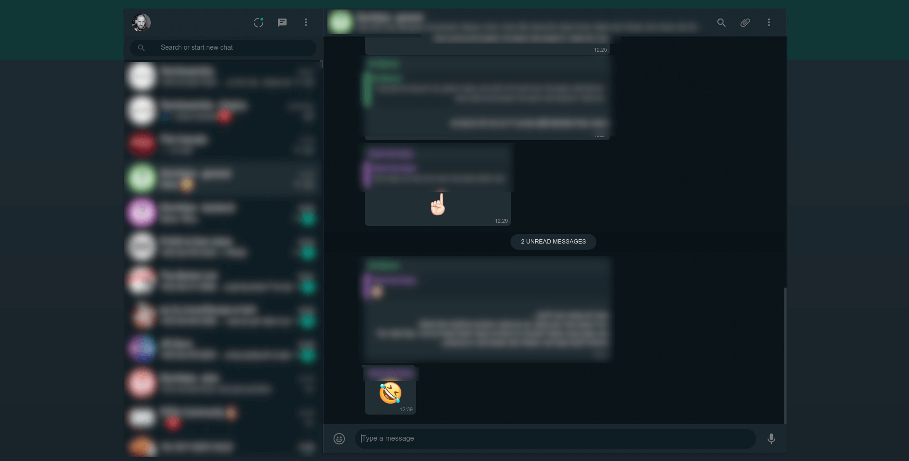

# WhatsApp Web Dark Mode (deprecated)

<h2 style="font-size: 20px; font-weight: bold; text-decoration: underline;">
  Note: this userscript is now deprecated, as WhatsApp now supports this natively in WhatsApp Web. It was a fun ride :)
</h2>

As of recently, WhatsApp Web has an official Dark Mode support that isn't shown yet. This Userscript makes it run by default.

## Installation

1. Get Greasemonkey support for your browser ([Tampermonkey usually does the trick](https://chrome.google.com/webstore/detail/tampermonkey/dhdgffkkebhmkfjojejmpbldmpobfkfo?hl=en))

2. Go to the [raw version](https://github.com/tkore/WhatsApp-Web-dark-mode/raw/master/WhatsApp-Dark-Mode.user.js) of WhatsApp-Dark-Mode.user.js

3. Click install

4. Refresh your WhatsApp Web tab and go wild

